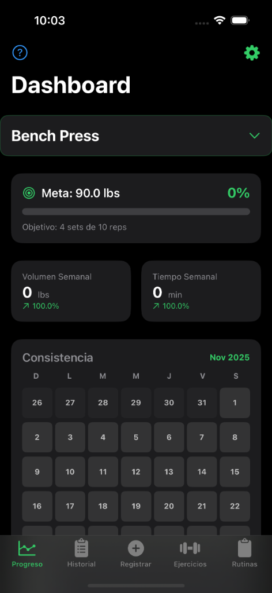
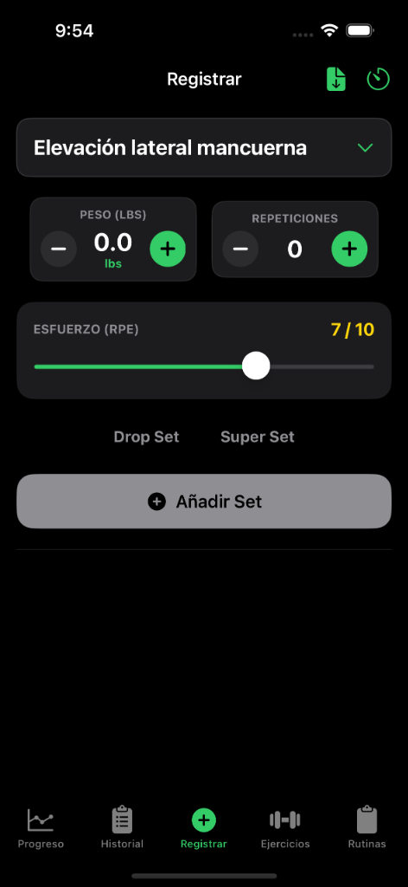
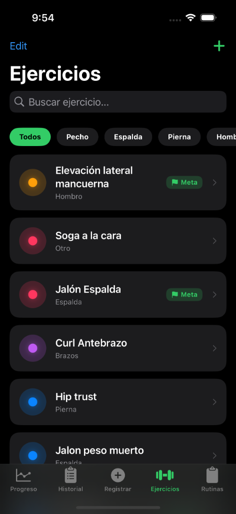

# GymRatp 🏋️‍♂️

Una aplicación moderna para el seguimiento de entrenamientos, diseñada para ayudarte a alcanzar tus metas de fitness con estilo y precisión.

## 📱 Capturas de Pantalla

| Dashboard | Registro de Sets | Ejercicios |
|:---------:|:----------------:|:----------:|
|  |  |  |

## 🛠️ Stack Tecnológico

GymRatp está construido utilizando las últimas tecnologías de desarrollo iOS para ofrecer una experiencia fluida y robusta:

*   **SwiftUI**: Interfaz de usuario declarativa y moderna.
*   **Firebase**:
    *   **Authentication**: Gestión segura de usuarios.
    *   **Firestore**: Base de datos NoSQL en tiempo real para sincronizar rutinas y progresos.
*   **Swift Charts**: Visualización de datos y progreso (volumen, fuerza, etc.).
*   **MVVM**: Arquitectura limpia y escalable.

## ✨ Características Principales

*   **Seguimiento de Entrenamientos**: Registra series, repeticiones, peso y RPE.
*   **Metas Personalizadas**: Define objetivos para cada ejercicio y visualiza tu progreso.
*   **Historial Detallado**: Revisa tus sesiones anteriores con estadísticas completas.
*   **Modo Oscuro**: Diseño elegante y amigable con la batería.
